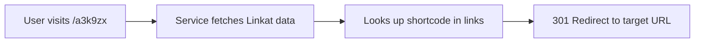

# AT Protocol Link Shortener

A **server-side** link shortening service powered by your [Linkat](https://linkat.blue) board. No database required - all links are fetched directly from AT Protocol!

## ✨ Features

- **Zero Configuration Database**: Uses your existing Linkat board as the data source
- ⚡ **Hash-Based Shortcodes**: Automatic 6-character codes generated from URLs (e.g., `/a3k9zx`)
- 🚀 **Server-Side Only**: Pure API-based, no client UI needed
- 🎯 **Smart Redirects**: Instant HTTP 301 redirects to your target URLs
- 🔍 **Automatic PDS Discovery**: Resolves your PDS endpoint via Slingshot
- ⚡ **Built-in Cache**: 5-minute cache for optimal performance

## 🚀 Quick Start

### 1. Clone and Install

```bash
git clone git@github.com:ewanc26/atproto-shortlink # or git@tangled.sh:ewancroft.uk/atproto-shortlink
cd atproto-shortlink
npm install
```

### 2. Configure Your DID

Create a `.env` file:

```bash
cp .env.example .env
```

Edit `.env` and add your AT Protocol DID:

```ini
# Find your DID at https://pdsls.dev/ by entering your handle
ATPROTO_DID=did:plc:your-did-here
```

**How to find your DID:**

1. Visit [PDSls](https://pdsls.dev/)
2. Enter your AT Protocol handle (e.g., `yourname.bsky.social`)
3. Copy the `did:plc:...` identifier

### 3. Set Up Your Linkat Board

If you don't have a Linkat board yet:

1. Visit [https://linkat.blue](https://linkat.blue)
2. Create a board with your links
3. Add your links with titles and emojis

The shortener will automatically generate unique 6-character codes for each URL!

### 4. Test Your Configuration (Optional)

Run the configuration test to verify everything is set up correctly:

```bash
npm run test:config
```

This will:

- ✅ Check if `.env` exists and is configured
- ✅ Validate your DID format
- ✅ Test PDS connectivity
- ✅ Verify your Linkat board is accessible
- ✅ Show a preview of your first few links

### 5. Run the Server

```bash
npm run dev
```

Visit `http://localhost:5173` to see your service running!

## 📖 Usage

Once running, your short links work like this:

```bash
# Redirect to your configured URLs
http://localhost:5173/a3k9zx      → Redirects to your GitHub
http://localhost:5173/b7m2wp      → Redirects to your blog
http://localhost:5173/c4n8qz      → Redirects to your portfolio

# View service info
http://localhost:5173/            → Shows API information and available links

# Get JSON list of links
http://localhost:5173/api/links   → Returns all short links as JSON
```

## 🔧 API Endpoints

| Endpoint      | Method | Description                     | Response     |
| ------------- | ------ | ------------------------------- | ------------ |
| `/`           | GET    | Service status and link listing | HTML         |
| `/:shortcode` | GET    | Redirect to full URL            | 301 Redirect |
| `/api/links`  | GET    | List all available short links  | JSON         |

### Example API Response

```json
{
	"success": true,
	"count": 3,
	"links": [
		{
			"shortcode": "a3k9zx",
			"url": "https://github.com/yourname",
			"title": "My GitHub Profile",
			"emoji": "💻",
			"shortUrl": "/a3k9zx"
		},
		{
			"shortcode": "b7m2wp",
			"url": "https://yourblog.com",
			"title": "Personal Blog",
			"emoji": "📝",
			"shortUrl": "/b7m2wp"
		}
	]
}
```

## 📝 How Shortcodes Work

Shortcodes are automatically generated as 6-character base62 hashes from your URLs. Each URL will always produce the same shortcode, ensuring consistency.

- **Base62 encoding**: Uses 0-9, a-z, A-Z (62 characters)
- **Collision-resistant**: 62^6 = ~56 billion possible combinations
- **Deterministic**: Same URL = same shortcode every time
- **URL-safe**: No special characters needed

## 🌐 Deployment

### Build for Production

```bash
npm run build
npm run preview  # Test the production build locally
```

### Deploy to Platforms

This project uses `@sveltejs/adapter-auto` which works with:

- **Vercel**: Push to GitHub and connect your repo
- **Netlify**: Push to GitHub and connect your repo
- **Cloudflare Pages**: Push to GitHub and connect your repo
- **Node.js**: Use `adapter-node` for standalone Node servers

For specific platforms, see [SvelteKit adapters](https://kit.svelte.dev/docs/adapters).

### Environment Variables for Deployment

Make sure to set `ATPROTO_DID` in your deployment platform's environment variables!

## ⚙️ Configuration

| Variable      | Required | Description          | Example             |
| ------------- | -------- | -------------------- | ------------------- |
| `ATPROTO_DID` | ✅ Yes   | Your AT Protocol DID | `did:plc:abc123xyz` |

## 🏗️ How It Works

1. **You maintain your links** in [Linkat](https://linkat.blue) (stored in `blue.linkat.board` collection)
2. **Service fetches on-demand** from your AT Protocol PDS via Slingshot resolution
3. **URLs are shortened** using deterministic base62 hash encoding
4. **Accessing a short link** (e.g., `/a3k9zx`) triggers an instant 301 redirect



## 🔒 Security

- ✅ All Linkat data is public by design
- ✅ No authentication required
- ✅ Read-only access to AT Protocol data
- ✅ No data storage (fetches on-demand with cache)
- ✅ 5-minute cache to prevent abuse

## 🛠️ Development

```bash
# Install dependencies
npm install

# Start dev server
npm run dev

# Type check
npm run check

# Format code
npm run format

# Check formatting
npm run lint
```

## 📦 Tech Stack

- **Framework**: [SvelteKit 2](https://kit.svelte.dev/)
- **Runtime**: Server-side only (no client JavaScript required)
- **Data Source**: AT Protocol (`blue.linkat.board` collection)
- **PDS Resolution**: [Slingshot](https://slingshot.microcosm.blue) by Microcosm
- **Redirects**: HTTP 301 (permanent)
- **Shortcode Format**: Base62 hash encoding

## 🔧 Troubleshooting

Having issues? Check the [Troubleshooting Guide](./TROUBLESHOOTING.md) for common problems and solutions.

Quick checks:

1. Run `npm run test:config` to verify your setup
2. Make sure Node.js 18+ is installed: `node --version`
3. Check your DID at [pdsls.dev](https://pdsls.dev/)
4. Verify your Linkat board at [linkat.blue](https://linkat.blue)

## 🤝 Contributing

Contributions are welcome! Please feel free to submit a Pull Request.

## 📄 Licence

AGPLv3 Licence - See [LICENCE](./LICENCE) file for details

## Links

- [Linkat](https://linkat.blue) - The link board service
- [AT Protocol](https://atproto.com) - The underlying protocol
- [SvelteKit](https://kit.svelte.dev) - The web framework
- [PDSls](https://pdsls.dev/) - Find your DID
- [Slingshot](https://slingshot.microcosm.blue) - Identity resolver

---

Made with ❤️ using AT Protocol and Linkat
